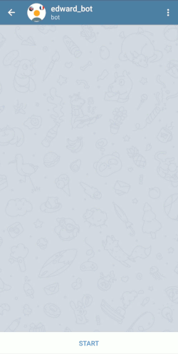

# languages_learning_telegram_bot

languages_learning_telegram_bot is a bot that allows you to test your language knowledge!
The words list is from the Oxford 3000: https://www.oxfordlearnersdictionaries.com/us/wordlist/
It's a list of the 3000 most commons words used in English (in fact 3870 words).
For now, the translations are one to one google translate translation.

### Demo 
You can test it here: 
[@lord_edward_teacher_bot](https://telegram.me/lord_edward_teacher_bot)


### Development
1. Contact @BotFather in order to create a new bot and receive a token.
2. Create .env file in the root directory with following variables: BOT_TOKEN=YOUR_TELEGRAM_BOT_TOKEN
3. Install dependencies and start the app:
```
npm i
npm index.js start
```
